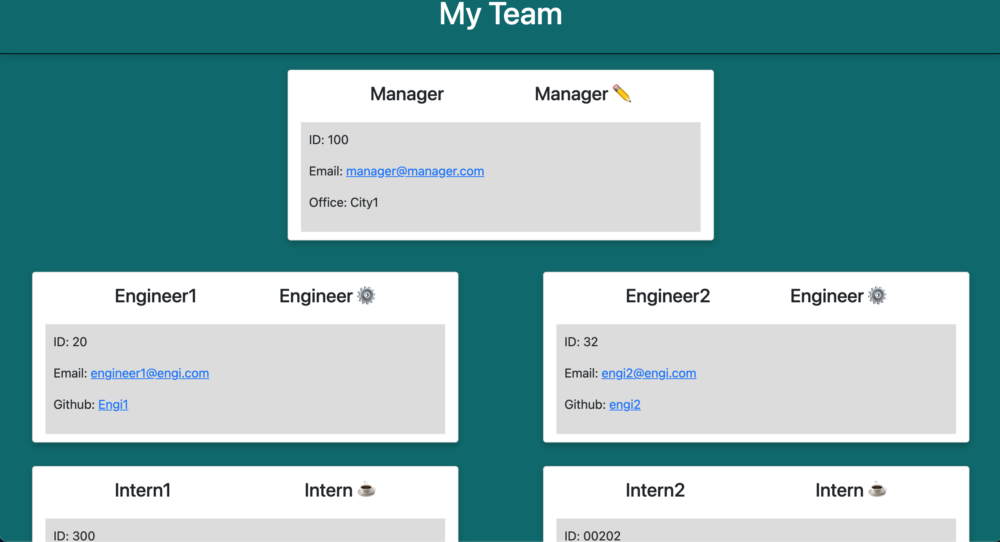

# Team Generator 
## Description 
Team Generator is terminal based application that prompts a series of questions to build you a webpage displaying your project team. All you have to do is type node app in the terminal and it will then prompt begin the questions. 
## Table of Contents 
* [Prompt](#prompt) 
* [Usage](#usage) 
* [Webpage](#webpage) 
* [Technology](#technology) 
* [Questions](#questions) 
## Prompt 
Type node app in the terminal and a series of questions as shown below will begin. 
 
It will ask if the member is a Manager, Engineer, or Intern. All 3 include a name, id, and email question(emails can be clicked to write an email). Manager is asked a question about their office location, Engineer their github(which will link to their github page), and Intern which school they attend.
## Usage 
This application is easy to use and is free to be used by the public.
## Webpage 
Once you have answered the questions an html document will be created along with a style sheet displaying your team which can be found in the dist folder.
An example webpage is show below as well as an individual card.

## Technology 
HTML, CSS, Bootstrap, Javascript, Node, npm, Inquirer, Jest, GitHub
## Questions 
GitHub: https://github.com/adambedingfield 
Email: adamcbedingfield@gmail.com 
